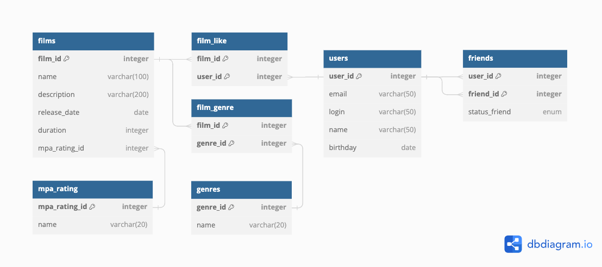

# Java-Filmorate
Бэкенд Spring Boot приложения, работащего с фильмами и оценками пользователей.

Технологический стек: Java, JDBC, Spring Boot, SQL, H2, Lombok, JUnit.

### Функциональность приложения:
1. Получение, добавление, удаление и обновление фильма;
2. Добавление и удаление лайка на фильм;
3. Получение списка популярных фильмов;
4. Получение всех фильмов;
5. Получение, добавление, удаление и обновление пользователя;
6. Получение списка всех пользователей;
7. Добавление и удаление друга;
8. Получение списка друзей и списка общих друзей;
9. Получение жанра и mpa-рейтинга по id;
10. Получение списка жанров и списка mpa-рейтингов.

### Модель базы данных (ER-диаграмма)



### Примеры sql-запросов к базе

1. Получение фильма с id = 7:
```sql
SELECT *
FROM films
WHERE film_id = 7;
```
2. Получение всех пользователей:
```sql
SELECT *
FROM users
```
